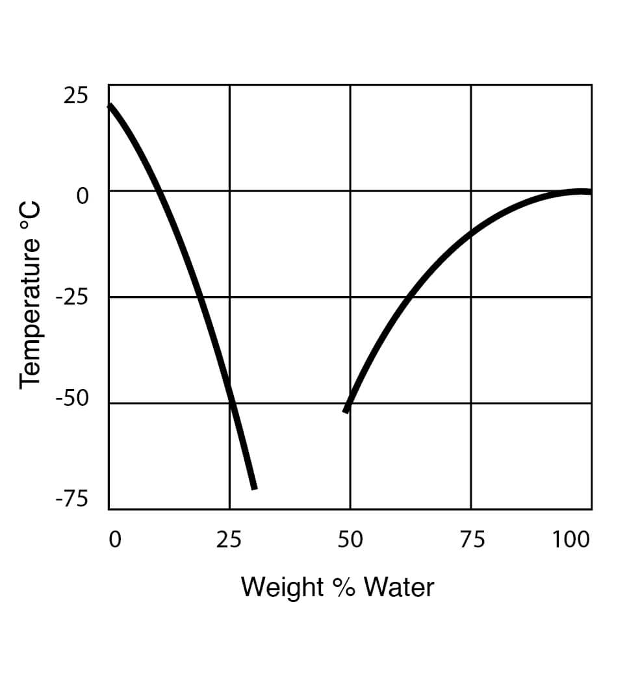
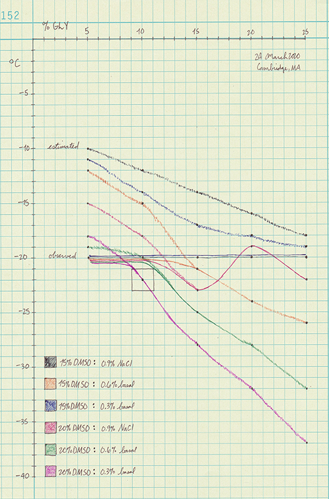

# Introduction

Cryptobiosis describes the suspended animation that some microbes enter under adverse conditions such as drought, cold, and lack of oxygen.
The kingdom fungi possesses a relatively well conserved and multifunctional signalling network called the Mitogen Activated Protein Kinase (MAPK) pathways that respond to changes in osmosis, light, pH, pheromones, etc.

This paper examines the physical chemical properties of supercooled aqueous solutions, and the physiological tolerances of filamentous fungi, to develop an inexpensive storage medium.
The parameters for success in this experiment include confirming that cultures are not only alive, but can also produce fruitbodies and spores upon revival.

Successful long-term culture storage is critical to any serious mushroom-related endeavor.
For basidiomycete (mushroom forming) fungi it remains an open problem.
The basidiomycete MAPK network, similar but different among species, is also implicated in
- cell morphology (highly variable from spore to shroom);
- sexual reproduction, including fruiting ability; and
- secondary metabolites of possible clinical significance.

My prior work on long-term storage
[diybio/water-cultures](https://pjc.is/diybio/water-cultures) and [diybio/perlite-protocol](https://pjc.is/diybio/perlite-protocol)
describes useful lessons in the state of the art.
This paper describes a novel medium informed by mammal flesh storage that
- uses a combination of nontoxic cryoprotectants like DMSO, glycerol, and tetralose;
- has a glass transition temperature around –20 °C for cell vitrification;
- quickly changes to a liqid at room temperature, allowing convenient revival;
- provides essential nutrients with low quantities of basal sugar and salt; and
- requires no specific equipment or recurring costs to successfully reproduce.

The medium should exhibit ideal properties at –20 °C, exert just enough osmotic stress to force hardship metabolism, and not otherwise starve the fungi.
A member of the Shroomery's PhD tribe inspired this work, suggesting that "sometimes the deep freeze isn't the answer."


# Materials and methods

The deionized water came from [add supplier] in [add city].
The USP glycerol came from [add supplier] in [add city].
The USP DMSO came from [add supplier] in [add city].

The cryotubes came from [add supplier] in [add city].
The freezer came from [add supplier] in [add city].


## Developing a test medium

I made blank tubes, standard 1.5 mL Eppendorfs, to produce multivariate freeze point data.
Equipment that measures ice granulation is beyond my grasp, so I reconstructed hypothetical curves from 30 data points.

Note that I used binary data (frozen or not?) and macro inspection (relative crystallization?) to estimate the curves.
All the measures below are in % w/v per 1 mL deionized water.
The basal saline is 50:50 sea salt and light malt extract.

| DMSO	| ×	| Glycerol	| ×	| Saline	|
| :--:	| :--:	| :--:		| :--:	| :--		|
|	|	| 5%		|	|		|
| 15%	|	| 10%		|	| 0.9% NaCl	|
|	| ×	| 15%		| ×	| 0.6% basal	|
| 20%	|	| 20%		|	| 0.3% basal	|
|	|	| 25%		|	|		|

I established scaled-down quantities to 1 mL test tubes with [Aqua-Calc's conversion tools](https://www.aqua-calc.com/calculate/weight-to-volume).
None of the tubes were made in a sterile environment, so random cells existed to act as possible granulation points.

The real value of the parameters is error-tolerant ±5 °C as long as the inoculated solution remains viscous and not crystals.
The tradeoff is between a simple formula that works, and a precise one that targets the exact glass transition temperature.

The main physical parameters I considered were freezing point by weight, osmotic pressure and related measurements like gravity and water potential, and the miscibility and solubility in water.
DMSO lowers the freezing point and glycerol disrups crystals.


| 	|
| :--				|
| Freezing Point Data for DMSO Water Solutions from [Gaylord Chemical](https://www.gaylordchemical.com/literature/dmso-physical-properties/) |


## Calculating the physical chemical properties

How to Calculate Osmotic Pressure
https://www.thoughtco.com/calculate-osmotic-pressure-example-609518

Osmotic pressure is expressed by the formula:

Π = iMRT

where<br />
Π is the osmotic pressure in atm<br />
i = van 't Hoff factor of the solute<br />
M = molar concentration in mol/L<br />
R = universal gas constant = 0.08206 L·atm/mol·K<br />
T = absolute temperature in K

Glycerol: C3H8O3

https://www.aqua-calc.com/page/volume-weight-conversions

---

https://en.wikipedia.org/wiki/Glycerol_(data_page)

| Glycerol (% w/w)	| Freezing (°C)	| SG (d<sup>15</sup>°)	|
| :--:			| :--:		| :--:			|
| 10			| –1.6		| 1.02415		|
| 20			| –4.8		| 1.04935		|
| 30			| –9.5		| 1.07560		|
| 40			| –15.5		| 1.10255		|
| 50			| –22.0		| 1.12985		|


## Freezing the solution

I put the normal tubes in a normal freezer box at –20 °C and waited for the ice question to resolve.
I votexed all the tubes for 5s and arranged them all away from the box edges.

Then I waited two weeks because of a more virulent flu season.
Several other people used the freezer in the meantime, moving and jostling the box.

When I tested the solidity, I also vortexed the unfrozen tubes 2s to induce crystals.
None of the manhandled tubes spontaneously froze.

Several tubes had fully formed snowflakes inside.
todo: Photograph a snowflake tube


# Results and discussion

The goal was to find a ratio of DMSO, glycerol, and media that behaved like a thick liquid or gel at –20 °C and vitrified the cells.
Additionally, the solution had to exert the minimum osmotic stress necessary to activate the Hog1 (high osmolarity glycerol) orthologues of diverse fungi.


## 20% DMSO : 10% glycerol : 0.3% sugar/salt

Please see the hypothetical curves below and note that the data isn't "measured" in a meaningful sense.
It's reconstructed from yes/no freezing data, along with visual inspection of the ice crystals.

How I interpret the curves is zooming in on one part of the wider trajectory of the DMSO : water freeze point curve.
I believe more irregularities will appear (e.g., the red line) the closer and more precisely you look.

Please do take the curves with a grain of salt becaue they represent educated guesses and not measurements.
The observed frozen tubes seem to suggest that dissolved salts inhibit DMSO's antifreeze power to a degree.

The outlined box is the "target zone" of freezing temperatures below –20 °C using the least possible glycerol.
Glycerol's osmotic power is too strong relative to its antifreeze power to use too much of.


| 	|
| :--				|
| Estimated (sketchy) and observed (solid) curves for 30 possible cyro formula |


## 5th generation results

todo:
Freeze, revive, and fruit cultures on a convenient basis.

# Future work

todo


## An algorithm for the reasoning

```sh
if !funding
  unset nitrogen

  switch conditions
    water content
    temperature
    etc.

  foreach condition
    while nature modulo condition
    do mimic nature's conditions

else
  foreach cryo method
    consider [cost, ease, convenience]

freeze slow; thaw fast
return blog post
```
