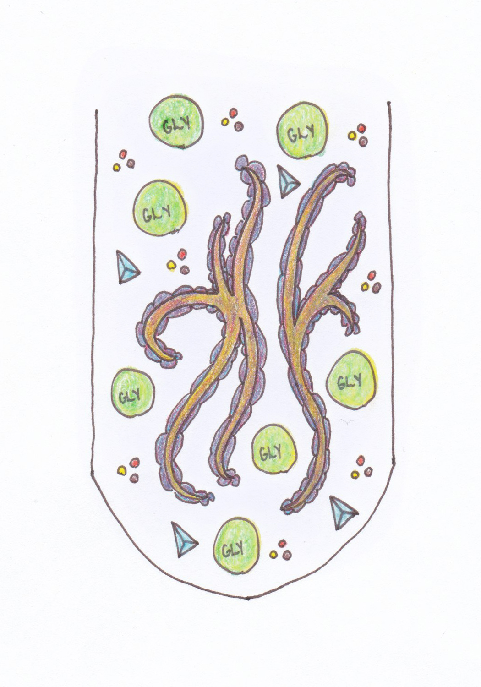
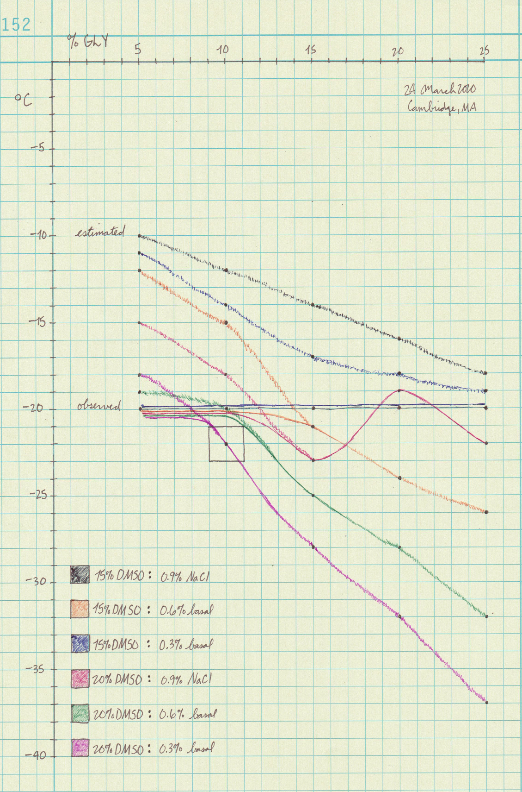

# Introduction

Cryptobiosis describes the suspended animation that some microbes enter under adverse conditions such as drought, cold, and lack of oxygen.
The kingdom fungi possesses a relatively well conserved and multifunctional signalling network called the Mitogen Activated Protein Kinase (MAPK) pathways that respond to changes in osmosis, light, pH, pheromones, etc.

This paper examines the physical chemical properties of supercooled aqueous solutions, and the physiological tolerances of filamentous fungi, to develop an inexpensive storage medium.
The parameters for success in this experiment include confirming that cultures are not only alive, but can also produce fruitbodies and spores upon revival.

Successful long-term culture storage is critical to any serious mushroom-related endeavor.
For basidiomycete (mushroom forming) fungi it remains an open problem.
The basidiomycete MAPK network, similar but different among species, is also implicated in
- cell morphology (highly variable from spore to shroom);
- sexual reproduction, including fruiting ability; and
- secondary metabolites of possible clinical significance.

My prior work on long-term storage
[diybio/water-cultures](https://pjc.is/diybio/water-cultures) and [diybio/perlite-protocol](https://pjc.is/diybio/perlite-protocol)
describes useful lessons in the state of the art.
This paper describes a novel medium informed by mammal flesh storage that
- uses a combination of nontoxic cryoprotectants like DMSO, glycerol, and tetralose;
- has a glass transition temperature around –20 °C for cell vitrification;
- quickly changes to a liqid at room temperature, allowing convenient revival;
- provides essential nutrients with low quantities of basal sugar and salt; and
- requires no specific equipment or recurring costs to successfully reproduce.

The medium should exhibit ideal properties at –20 °C, exert just enough osmotic stress to force hardship metabolism, and not otherwise starve the fungi.
A member of the Shroomery's PhD tribe inspired this work, suggesting that "sometimes the deep freeze isn't the answer."


| 	|
| :--				|
| What's in the tubes: DMSO coats fungal hyphae while glycerol disrupts ice crystal tetrahedra. Dissolved sugar and salt buffer the solution and provide essential nutrients. |


# Materials and methods

The deionized water came from [add supplier] in [add city].
The sea salt came from [add supplier] in [add city].
The light malt extract (CBW Bavarian Wheat) came from Breiss Malt & Ingredients in Chilton, WI.

The DMSO came from [add supplier] in [add city].
The glycerol came from [add supplier] in [add city].
The cryotubes (№ W985868) came from DWK Life Sciences (Wheaton) in Millville, NJ.


## Developing a test medium

I made blank tubes, standard 1.5 mL Eppendorfs, to produce multivariate freeze point data.
Equipment that measures ice granulation is beyond my grasp, so I reconstructed hypothetical curves from 30 data points.

Note that I used binary data (frozen or not?) and macro inspection (relative crystallization?) to estimate the curves.
All the measures below are in % w/v per 1 mL deionized water.
The basal saline is 50:50 sea salt and light malt extract.

| DMSO	| ×	| Glycerol	| ×	| Saline	|
| :--:	| :--:	| :--:		| :--:	| :--		|
|	|	| 5%		|	|		|
| 15%	|	| 10%		|	| 0.9% NaCl	|
|	| ↗	| 15%		| ↘	| 0.6% basal	|
| 20%	|	| 20%		|	| 0.3% basal	|
|	|	| 25%		|	|		|

I established scaled-down quantities to 1 mL test tubes with [Aqua-Calc's conversion tools](https://www.aqua-calc.com/calculate/weight-to-volume).
None of the tubes were made in a sterile environment, so random cells existed to act as possible granulation points.

The real value of the parameters is error-tolerant ±5 °C as long as the inoculated solution remains viscous and not crystals.
The tradeoff is between a simple formula that works, and a precise one that targets the exact glass transition temperature.

The main physical parameters I considered were freezing point by weight, osmotic pressure and related measurements like gravity and water potential, and the miscibility and solubility in water.
DMSO lowers the freezing point and glycerol disrupts crystals.


## Measuring the chemical properties

**Pressure.**
Fungi normally maintain internal turgor pressures around 600 kPa at room temperature (293 K).
http://www.yorku.ca/planters/Mycota_Review.pdf

The molarity of the solutes was 2.55984 M (20% DMSO), 1.08585 M (10% glycerol), and 0.05133 M (0.3% saline).
To estimate the osmotic stress of combined solutes at 253.15 K on a typical terrestrial fungus, I used the below version of the ideal gas law.

π = MRT, _where_

`π =` osmotic pressure in atm<br />
`M =` molar concentration in mol/L<br />
`R =` normal gas constant, 0.08206 L·atm/K·mol<br />
`T =` absolute temperature in K

Unsure of how volume affects osmolarity, I used
[R. Nave's HyperPhysics calculator](http://hyperphysics.phy-astr.gsu.edu/hbase/Kinetic/ospcal.html)
to 1 mL volumes, what will be in each tube:

- 0.020g DMSO, 538.79898 kPa
- 0.010g glycerol, 228.55107 kPa
- 0.003g saline, 108.04467 kPa

The combined osmotic pressure is 875.39472 kPa.
Subtracting the 600 kPa internal pressure associated with active growth,
this leaves 275.39472 kPa of environmental stress in an otherwise unpressurized environment, within and without.

That stress is about 46% of the reference 600 kPa, suggesting that hyphae will be squeezed to about 54% their normal size.
The fungi themselves will mitigate this to a degree by taking in glycerol and producing it themselves.

Given that fungi are known to survive in up to 5M NaCl, the effects seem gentle enough in terms of adverse conditions.
Nobody wants to be stuffed into a supercold tube with DMSO making you taste garlic.

**Freezing Point.**
I votexed the tubes for 5s and arranged them away from the edges of a freezer box.
I put the box in a –20 °C freezer and waited for the ice question to resolve.

After two weeks, I vortexed the unfrozen tubes 2s to induce crystals.
None of the manhandled tubes spontaneously froze.

Several tubes had fully formed snowflakes inside.
todo: Photograph a snowflake tube.

**pH.**
`todo:`
Test the pH of a 200 mL production batch before autoclaving.


| 	|
| :--					|
| Freezing Point Data for DMSO Water Solutions from [Gaylord Chemical](https://www.gaylordchemical.com/literature/dmso-physical-properties/) |


## Preparing the culture tubes

I made a somewhat larger batch of medium and used it to wash the cells.
The ingredients were, per 100 mL of deionized water,

- 0.15g sea salt,
- 0.15g light malt extract,
- 25.24 mL DMSO, and
- 11.2 mL glycerol.

`todo:`
Describe fermenting for 5 days in MYPB until the cusp of the exponential phase.
Then repeatedly centrifuge and wash the pellet in storage medium.
Aim for a thick solution of fine hyphae fragments, to deposit 5 μL on a plate.


# Results and discussion

The goal was to find a ratio of DMSO, glycerol, and media that behaved like a thick liquid or gel at –20 °C and vitrified the cells.
Additionally, the solution had to exert the minimum osmotic stress necessary to activate the Hog1 (high osmolarity glycerol) orthologues of diverse fungi.


## 20% DMSO : 10% glycerol : 0.3% sugar/salt

Please see the hypothetical curves below and note that the data isn't "measured" in a meaningful sense.
It's reconstructed from yes/no freezing data, along with visual inspection of the ice crystals.

I interpret the curves like zooming in on one part of the wider DMSO : water freeze point curve.
I believe more irregularities will appear (e.g., the red line) the closer and more precisely you look.

Please do take the curves with a grain of salt becaue they represent educated guesses and not measurements.
The observed frozen tubes seem to suggest that dissolved salts inhibit DMSO's antifreeze power to a degree.

The outlined box is the "target zone" of freezing temperatures below –20 °C using the least possible glycerol.
Its gravity is too strong relative to its antifreeze power to use too much of.


| 	|
| :--					|
| Estimated (sketchy) and observed (solid) curves for 30 possible cyro formula |


## 5th generation results

The 5th generation continues the work at
[diybio/water-cultures](/diybio/water-cultures),
which itself continues the work at
[AndyHinton's Journal](https://www.shroomery.org/forums/showflat.php/Number/24031222).
The progression is
dH<sub>2</sub>O → saline → basal saline → basal cryo
in modified dram vials → blood serum tubes → cryo tubes.
For the table below,

- Tubes 01–24 are numbered alphabetically as of 2020-04-01, the last time I took full stock and the epoch for my collection.
- Tubes 25–*n* are numbered in the order processed and may appear out of alphabetical order.
- The HexID is an arbitrary string used for general tagging and tracking across different platforms.
- 🔬 denotes whether polarized light microscopy data exists for the mycelium before and after storage.
- 🧬 denotes whether Sanger sequencing data exists for the NS7/ITS4 region from [diybio/fungi-barcodes](/diybio/fungi-barcodes).

| Tube	| Vital	| Binomial			| Common			| Strain			| Date		| P-Value| HexID| Notes |
| :-:	| :-:	| :--				| :--				| :--				| :-:		| :-:	| :-:	| :-- |
| 01	| ?	| *Aspergillus niger*		| black mold			| Carolina			| 2019-09-21	| P-1	| `3D5D`| 🔬 🧬 |
| 02	| ?	| *Coprinus comatus*		| shaggy mane			|				| 2019-10-09	| P-2	| `4C9B`| 🔬 🧬 |
| 03	| ?	| *Cyclocybe aegerita*		| poplar mushroom		|				| 2018-04-10	| P-5	| `DFC6`| 🔬 🧬 |
| 04	| ?	| *Fomitopsis betulina*		| birch polypore		| Mass Mushroom Fest '19	| 2019-10-09	| P-2	| `34CA`| 🔬 🧬 |
| 05	| ?	| *Ganoderma curtisii*		| gold reishi			| Ryan Paul Gates		| 2019-03-07	| P-1	| `867A`| 🔬 |
| 06	| ?	| *Ganoderma lucidum*		| lingzhi reishi		| Ryan Paul Gates		| 2018-02-10	| P-1	| `49E3`| 🔬 🧬 |
| 07	| ?	| *Ganoderma sessile*		|				| Ryan Paul Gates · HW		| 2018-02-03	| P-1	| `5763`| 🔬 🧬 |
| 08	| ?	| *Grifola frondosa*		| hen of the woods		| Charles River			| 2018-12-29	| P-2	| `CD38`| 🔬 🧬 |
| 09	| ?	| *Grifola frondosa*		| hen of the woods		| Fat Moon Farm			| 2018-02-10	| P-1	| `8DE3`| 🔬 🧬 |
| 10	| ?	| *Hericium abietis*		| bear's head			|				| 2019-09-21	| P-4	| `BC2B`| 🔬 🧬 |
| 11	| ?	| *Hericium coralloides*	|				| Bryant Homestead		| 2019-09-21	| P-2	| `7D68`| 🔬 🧬 |
| 12	| ?	| *Inonotus obliquus*		| chaga				| leschampignons · Wild		| 2019-09-21	| P-1	| `6254`| 🔬 🧬 |
| 13	| ?	| *Ischnoderma resinosum*	| benzoin bracket		| Bryant Homestead		| 2018-02-10	| P-1	| `7873`| 🔬 🧬 |
| 14	| ?	| *Laetiporus* sp.		| chicken of the woods		|				| 2018-03-31	| P-1	| `BC74`| 🔬 |
| 15	| ?	| *Lentinula edodes*		| shiitake			| 3782				| 2018-02-10	| P-4	| `0F8C`| 🔬 🧬 |
| 16	| ?	| *Penicillium roqueforti*	| blue cheese mold		|				| 2019-09-21	| P-2	| `3626`| 🔬 🧬 |
| 17	| ?	| *Pholiota microspora*		| nameko			| JPN				| 2019-09-21	| P-1	| `42FD`| 🔬 🧬 |
| 18	| ?	| *Pholiota microspora*		| nameko			| Mycoterra Farm		| 2018-11-20	| P-7	| `39D9`| 🔬 🧬 |
| 19	| ?	| *Pleurotus columbinus*	| blue oyster			| Mycoterra Farm		| 2018-11-20	| P-5	| `0586`| 🔬 🧬 |
| 20	| ?	| *Pleurotus eryngii*		| king trumpet			|				| 2019-02-26	| P-1	| `E48E`| 🔬 🧬 |
| 21	| ?	| *Pleurotus ostreatus*		| pearl oyster			| Black Pearl			| 2019-10-09	| P-2	| `ACEA`| 🔬 🧬 Chinese GMO pirate strain |
| 22	| ?	| *Pleurotus ostreatus*		| pearl oyster			| Mycoterra Farm		| 2018-11-20	| P-5	| `6AC1`| 🔬 🧬 |
| 23	| ?	| *Pleurotus tuber-regium*	| king tuber			|				| 2019-09-21	| P-2	| `EF1B`| 🔬 🧬 |
| 24	| ?	| *Stropharia rugoso-annulata*	| garden giant · wine cap	|				| 2019-09-21	| P-2	| `5547`| 🔬 |

`todo:`
Freeze, revive, and fruit cultures on a convenient basis.


# Future work

`todo`


## An algorithm for the reasoning

```
if !funding
  unset nitrogen

  switch conditions
    water content
    temperature
    etc.

  foreach condition
    while nature modulo condition
    do mimic nature's conditions

else
  foreach cryo method
    consider [cost, ease, convenience]

freeze slow; thaw fast
return blog post
```
